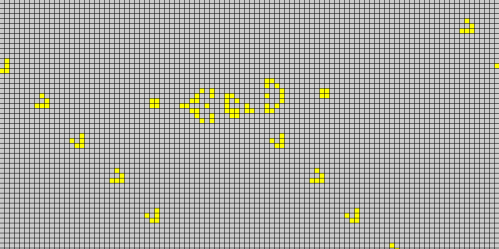
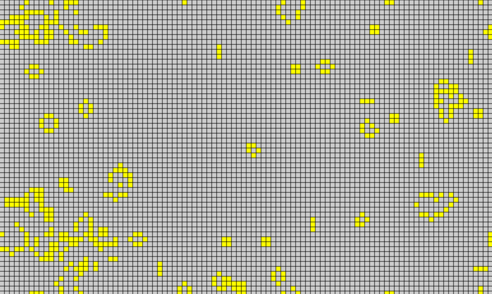
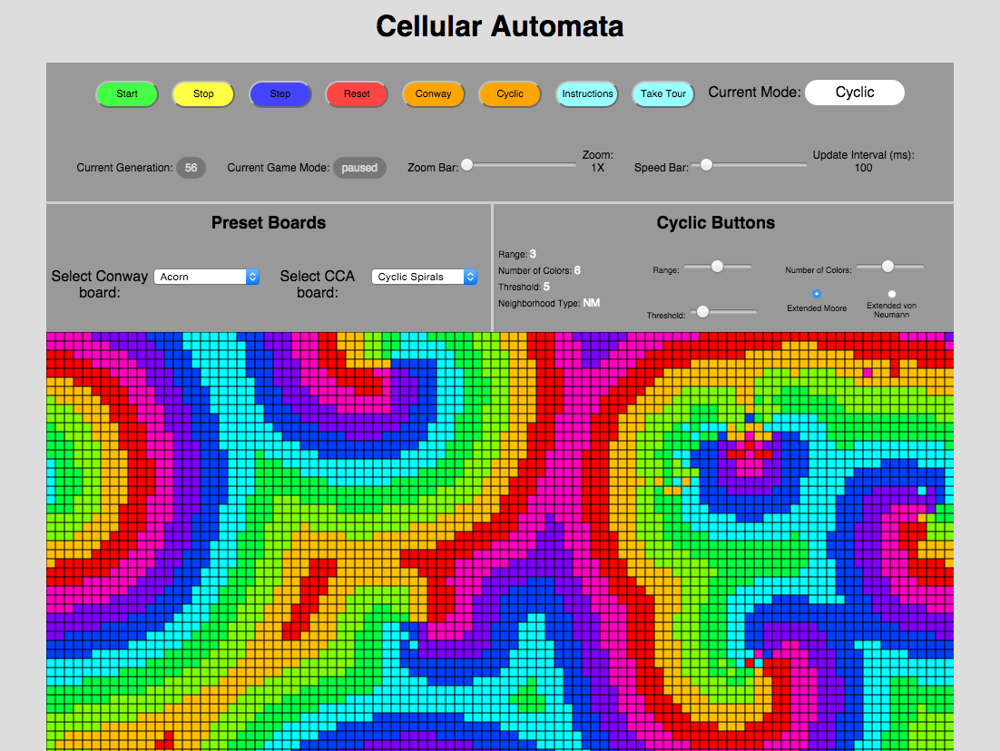

# Cellular Automata
[Live Link][live]

[live]:http://peterbenavides.site/CCA/GoL.html

# Background

A cellular automaton is a system of cells localized to discrete points on a grid. [Wikipedia](https://en.wikipedia.org/wiki/Cellular_automaton) offers the following description:
>A cellular automaton consists of a regular grid of cells, each in one of a finite number of states, such as on and off (in contrast to a coupled map lattice). The grid can be in any finite number of dimensions. For each cell, a set of cells called its neighborhood is defined relative to the specified cell. An initial state (time t = 0) is selected by assigning a state for each cell. A new generation is created (advancing t by 1), according to some fixed rule (generally, a mathematical function) that determines the new state of each cell in terms of the current state of the cell and the states of the cells in its neighborhood.

Cellular automata as models have a rich variety of settings and classifications. The automata simulated by this software all use a Cartesian plane as the grid, involve rules which are applied evenly to all cells, and the rules do not evolve over time. The board for the simulations implements a wrapping feature, making many of the infinite-growth patterns impossible. The wrap creates a toroidal simulation space which limits the behavior of certain Conway patterns, but also allows for cyclic automaton behavior despite the small grid size.

# How to play

The easiest way to begin playing is to choose one of the preset board for either the Conway or Cyclic setting. The Conway patterns require pressing the green "Start" button near the top. While in Conway mode, the mouse can be used to draw patterns onto the board (even while the simulation is running!). The "Cylic Buttons" pane allows for changing the variables governing the Cyclic mode simulations.

The buttons at the top of the screen allow for starting and stopping the simulation as well as advancing the simulation by just one step. The reset button will reset the board to whatever the last saved state was (or a random distribution for Cyclic boards).

# Conway's Game of Life

One of the most famous cellular automaton is [Conway's Game of Life](https://en.wikipedia.org/wiki/Conway%27s_Game_of_Life). In this simulation, cells can only be in two states, on or off. The cells update their positions based only on their immediate neighbors in their [Moore neighborhood](https://en.wikipedia.org/wiki/Moore_neighborhood).

If an active cell has more than three neighbors or less than two, the cell dies, as if from overpopulation or loneliness respectively. If a dead cell has exactly three neighbors, it comes alive.

Despite the simplicity of the rules, Conway's game remains one of the most popular CA models due to the multiplicity of important pattern types. These include oscillators of various periods, agars, spaceships, puffers, factories, and even a [simple CPU with ram](https://www.youtube.com/watch?v=My8AsV7bA94).

# Cyclic Cellular automata

Cyclic cellular automata are a broader set of automata, consisting of cellular automata with a larger range of rule variability, and a general tendency towards a stable, periodic steady-state. All the automata modeled here exist on a Cartesian plane with two dimensions.

There are four main variables which dictate the evolution of a cellular automaton from a random seeding of cell states. The first is the range. This number determines how far a given cell will look from its own position in order to update its state. The second is the threshold.
The threshold determines how many of the cells must be the next state in the sequence in order for the current cell to advance state. The next is the number of states, displayed here as the number of colors. Lastly, the neighborhood-type changes whether cells count diagonal neighbors (Moore neighborhood) or orthogonal neighbors only (von Neumann neighborhood). These can all be tweaked using the "Cyclic Buttons" which will update the current state of the variables.

Cyclic automata evolve by a progression into one of three modes. The rules for a given automaton determine whether or not it will advance to a higher mode. The first mode is a chaotic soup where cells are starting to clump up. The second mode occurs when enough of these clumps form self-sustaining fronts which begin sweeping across the board and colliding with pockets of "static" and other fronts. The final and most rule-dependent mode is the spiral mode. The spirals form from regions where all states available in the sequence are next to each other and can progress smoothly between each of the colors. These spirals overtake the wavefronts and eventually come to dominate the board.
